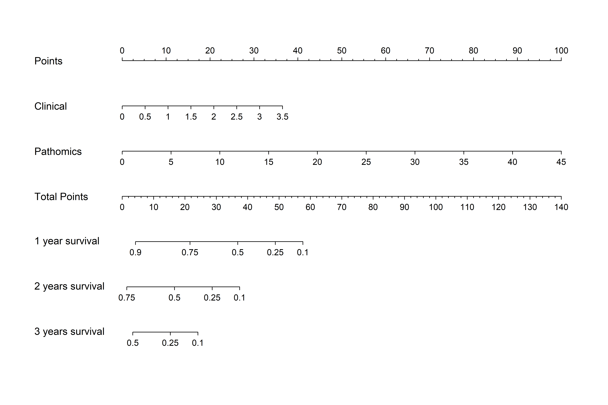

The main objective of this study was to construct a predictive model for patient overall survival (OS) that combines clinical and pathomics data. We first conducted a thorough analysis of clinical features using Cox regression techniques to develop a machine learning-based clinical signature model (Clinical_Sig).

We then explored the potential of pathomics data in survival prediction. By employing deep learning algorithms to analyze pathomics slides and using multi-instance aggregation, we derived a patient-level survival and stratification prediction, which we termed the pathomics signature (Path_Sig).

In the final step, we integrated the clinical features and pathomics signature to create a comprehensive nomogram, referred to as the combined model. This model was designed for in-depth interpretation and analysis. Figure 1 in the manuscript provides a visual representation of the analysis workflow, detailing the sequential steps taken to achieve the research objectives.

Fig1. Workflow of our study.

## Materials & Methods

### Data Set

In this study, we divided the entire dataset of 700 samples into a 7:3 split for the training and test sets. 

### Image Acquisition

> 填写一下

### Pathomics

#### Patch Level Prediction

In this study, we developed a histopathological patch-level classifier using the ResNet18 deep learning model for feature extraction through a specialized training approach. The classifier's patch-level predictions were aggregated to derive whole slide image (WSI) features, which were then integrated into a separate machine learning model for advanced analysis, as illustrated in the red section of our process flowchart.

**Data Preprocessing**: Given the significant size of WSIs (typically around 100,000 x 50,000 pixels), we acquired whole slide images at a 20x objective lens magnification, achieving a pixel resolution of approximately 0.5μm/pixel. We partitioned them into smaller 512x512 patches and utilized OnekeyAI's OKT-patch2predict tool to eliminate all white backgrounds, resulting in over 3 million distinct, non-overlapping tiles.

**Weakly Supervised Learning**: Our pathomics models were developed using a weakly supervised learning framework, focusing on the time-dependent 2-year survival rate for training patch-level models. By segmenting WSIs into smaller patches, we ensured that all patches from a single sample shared the same survival label, thereby facilitating the training process under weak supervision.

**Model Training**: For patch-level prediction, we employed the ResNet18 model, selected for its proven success in the ImageNet competition and its efficiency in training. Our objective was to determine the likelihood of each patch being classified into a category corresponding to its WSI. Detailed training specifics are provided in Supplementary Material 1A.

#### Multi-Instance Learning for WSI Integration

After training our deep learning model, we focused on utilizing multi-instance learning to aggregate the predictions of individual patches. This approach allowed us to generate comprehensive whole slide image (WSI) level predictions. We developed two distinct machine learning methodologies for integrating patch probabilities, which are detailed in Supplementary Material 1B.

#### Pathomics Signature

In our study, we integrated patch-level predictions, probability histograms, and TF-IDF features to construct tailored patient profiles. To refine feature selection, we employed the Pearson correlation coefficient, retaining only one feature from each pair with a correlation coefficient greater than 0.9. This step was crucial in determining the final set of features for our pathomics model, which we termed the *Pathomics Signature*. The Pathomics Signature plays a vital role in providing detailed insights into individual patient diagnoses and prognoses, thereby enhancing the precision of medical assessments.

### Model Evaluation

**Clinical Signature (Clinical_Sig)**: We utilized multivariate Cox regression to model the clinical variables and construct a clinical predictive model. The outcomes of this model were termed the Clinical Signature.

**Combined Model**: To enhance its practical application in clinical settings, we integrated the selected clinical features with the Clinical Signature and Pathomics Signature to develop a Cox-based combined model. This model was visualized through a nomogram for ease of interpretation.

To compare the clinical characteristics of patients, we performed a series of statistical tests, including the independent sample t-test and the χ² test. The χ² test was applied to discrete variables, while the t-test was used for continuous variables involving two groups. Table 1 presents the baseline characteristics of our cohort. The results show that all comparisons of clinical features between groups had a p-value > 0.05, indicating no significant differences in our random allocation.

| feature_name |        ALL |      train |        test | pvalue |
| -----------: | ---------: | ---------: | ----------: | -----: |
|          Age | 61.77±9.62 | 61.68±9.66 |  61.98±9.54 |  0.605 |
|            T |            |            |             |  0.525 |
|          1.0 |  70(10.00) |  52(10.61) |    18(8.57) |        |
|          2.0 | 300(42.86) | 213(43.47) |   87(41.43) |        |
|          3.0 | 324(46.29) | 222(45.31) |  102(48.57) |        |
|          4.0 |    6(0.86) |    3(0.61) |     3(1.43) |        |
|            N |            |            |             |  0.187 |
|          0.0 | 275(39.29) | 202(41.22) |   73(34.76) |        |
|          1.0 | 304(43.43) | 207(42.24) |   97(46.19) |        |
|          2.0 | 108(15.43) |  70(14.29) |   38(18.10) |        |
|            A |   13(1.86) |   11(2.24) |     2(0.95) |        |
|            M |            |            |             |  0.422 |
|          0.0 |    3(0.43) |    3(0.61) |        null |        |
|          1.0 | 696(99.43) | 486(99.18) | 210(100.00) |        |
|          5.0 |    1(0.14) |    1(0.20) |        null |        |
|       Degree |            |            |             |  0.338 |
|       中分化 | 502(71.71) | 345(70.41) |  157(74.76) |        |
|   中至高分化 |    5(0.71) |    4(0.82) |     1(0.48) |        |
|       低分化 |   33(4.71) |   20(4.08) |    13(6.19) |        |
|   低至中分化 | 157(22.43) | 119(24.29) |   38(18.10) |        |
|       高分化 |    3(0.43) |    2(0.41) |     1(0.48) |        |
|           DU |            |            |             |    1.0 |
|          0.0 | 195(27.86) | 137(27.96) |   58(27.62) |        |
|          1.0 | 505(72.14) | 353(72.04) |  152(72.38) |        |
|         BILE |            |            |             |  0.438 |
|          0.0 | 473(67.57) | 336(68.57) |  137(65.24) |        |
|          1.0 | 227(32.43) | 154(31.43) |   73(34.76) |        |
|     胰周脂肪 |            |            |             |  0.672 |
|          0.0 | 169(24.14) | 121(24.69) |   48(22.86) |        |
|          1.0 | 531(75.86) | 369(75.31) |  162(77.14) |        |
|     脉管癌栓 |            |            |             |  0.361 |
|          0.0 | 471(67.29) | 324(66.12) |  147(70.00) |        |
|          1.0 | 229(32.71) | 166(33.88) |   63(30.00) |        |
|     胰周神经 |            |            |             |  0.386 |
|          0.0 |  83(11.86) |  62(12.65) |   21(10.00) |        |
|          1.0 | 617(88.14) | 428(87.35) |  189(90.00) |        |
|     胰内神经 |            |            |             |  0.444 |
|          0.0 |   46(6.57) |   35(7.14) |    11(5.24) |        |
|          1.0 | 654(93.43) | 455(92.86) |  199(94.76) |        |
|          Sex |            |            |             |  0.685 |
|           女 | 273(39.00) | 194(39.59) |   79(37.62) |        |
|           男 | 427(61.00) | 296(60.41) |  131(62.38) |        |

Table 1. baseline characteristics of our cohort.

Our study employed a range of essential techniques to address significant challenges in medical image analysis. For Survival Analysis, Cox proportional hazards models with L2 regularization and Kaplan-Meier analysis were constructed. We grouped the samples based on the median of the predicted hazard ratios (HRs) for each sample. The significance of separation was determined using the multivariate log-rank test.

For the analysis, we utilized various software tools, including ITK SNAP v.3.8.0, and custom code written in Python v.3.7.12. Python packages employed in the analysis include PyTorch v.1.8.0, Onekey v.2.2.3, scikit-learn v.1.0.2, Pyclinical v.3.0, and Lifelines v.0.27.0.

## Results

### Clinical Signature

**Clinical Features**: We analyzed these clinical features using the Cox model, evaluating the Hazard Ratio (HR) and corresponding p-value for each feature.

| Feature Name |   coef | exp(coef) lower 95% | exp(coef) upper 95% | pvalue |
| -----------: | -----: | ------------------: | ------------------: | ------ |
|            T |  0.123 |               0.976 |               1.312 | 0.102  |
|            N |  0.145 |               1.016 |               1.314 | <0.05  |
|            M |  0.132 |               0.775 |               1.681 | 0.504  |
|       Degree |  0.160 |               1.089 |               1.264 | <0.05  |
|           DU |  0.053 |               0.843 |               1.318 | 0.643  |
|         BILE | -0.192 |               0.662 |               1.028 | 0.087  |
|     胰周脂肪 | -0.040 |               0.744 |               1.241 | 0.758  |
|     脉管癌栓 |  0.138 |               0.922 |               1.428 | 0.218  |
|     胰周神经 |  0.201 |               0.813 |               1.836 | 0.334  |
|     胰内神经 |  0.501 |               0.979 |               2.783 | 0.060  |
|          Sex |  0.142 |               0.939 |               1.414 | 0.175  |
|          Age |  0.020 |               1.009 |               1.031 | <0.05  |

Table 2. Pvalue of clinical feature in cox model.

Fig.2 HR and 95%CI of each clinical features.

**Clinical Results**: In the model built on clinical data, the c-index for the training and test sets were 0.648 and 0.595, respectively. We found that clinical features performed suboptimally in prognosis analysis. In the test set, patients could not be effectively distinguished (p-value > 0.001).

Fig3. Kaplan-Meier analysis of the clinical signature. In the training set, the clinical signature effectively distinguishes between two groups. However, in the test set, the log-rank test p-value > 0.001 indicates that the clinical features are not able to provide an effective prediction of patient survival.

### Pathomics Signature

**WSI-Level Survival**: Similar to clinical, we obtained 206 features through multi-instance learning, with Bag of Words (BoW) and Probability of Label Histogram (PLH) features each accounting for 103, while probability features and label features accounted for 2 and 101, respectively. We employed correlation coefficients and Lasso-Cox regression for feature selection, ultimately obtaining 6 pathomics features. These features were used in univariate Cox modeling, resulting in c-index values of 0.809 for the training set and 0.754 for the test set.

Fig4. KM of Pathomics Signature

**Grad-CAM**: Grad-CAM class localization maps are generated by visualizing the gradients flowing into the final convolutional layer of the network, just before the fully connected layers. This layer is optimal for map generation as it retains class-specific spatial information from the input image, which is lost in the fully connected layers. A key advantage of Grad-CAM over conventional CAMs is that it does not require any modifications to the existing model architecture or retraining of the model. In Fig 5, the last convolutional layer of the network was made transparent to the prediction of the response, as illustrated.

Fig5, These are the Grad-CAMs of patches in predicting alive and death.

**Visualization of Predictions**: This statement presents the prediction results for samples 1710327 and 1836980. These results demonstrate the capability of our pathomics model to accurately predict the tiles across various areas of the WSI.

Fig6. Patch-level prediction of samples 1710327 and 1836980, from left to right: original slide, ROI annotations, predicted labels, and prediction probability heatmap.

### Multiomics Fusion

#### Survival Analysis

In this study, we evaluated the predictive performance of three models: the Combined model (integrating clinical and pathomics data), the Pathomics Signature (Path) model, and the Clinical Signature (Clinical) model. The performance was assessed using a metric such as the concordance index (C-index) or area under the curve (AUC), with higher values indicating better predictive accuracy. 

Our results indicated that the Path model demonstrated superior performance in both the training (C-index: 0.809) and test (C-index: 0.754) cohorts, suggesting its effectiveness in leveraging pathomics data for outcome prediction. In contrast, the Clinical model exhibited relatively lower performance, with C-index values of 0.648 and 0.595 in the training and test cohorts, respectively. This indicates that the clinical variables alone may not provide as strong predictive power as pathomics data.

Interestingly, the Combined model, which integrates both clinical and pathomics data, showed performance metrics of 0.781 and 0.739 in the training and test cohorts, respectively. Although the Combined model outperformed the Clinical model, it did not achieve the same level of performance as the Path model. This observation suggests that the inclusion of clinical data in the Combined model did not enhance its predictive ability and may have even detracted from the performance achieved by the Path model alone. To improve the Combined model's performance, future work may need to reevaluate the clinical variables being used or explore alternative integration methods for clinical and pathomics data.

| Combined |  Path | Clinical | Cohort |
| -------: | ----: | -------: | ------ |
|    0.781 | 0.809 |    0.648 | train  |
|    0.739 | 0.754 |    0.595 | test   |

Table 3. C-index of each Signature

Fig7. KM of combined model

Fig8. Combined model visualized by Nomogram.

#### Time-Dependent ROC Analysis

We conducted time-dependent receiver operating characteristic (ROC) analysis on these models to depict survival rates at 1, 2, and 3 years. The results, focusing on the Area Under the Curve (AUC) values, highlight the varying predictive capabilities of the Clinical, Pathology, and Combined models across different times and cohorts (Train and Test).

| Signature | Accuracy |   AUC |          95% CI | Sensitivity | Specificity |   PPV |   NPV |    Survival | Cohort |
| --------: | -------: | ----: | --------------: | ----------: | ----------: | ----: | ----: | ----------: | ------ |
|  Clinical |    0.652 | 0.703 | 0.6477 - 0.7578 |       0.670 |       0.647 | 0.366 | 0.865 | 1Y Survival | Train  |
| Pathology |    0.789 | 0.901 | 0.8726 - 0.9298 |       0.925 |       0.747 | 0.527 | 0.970 | 1Y Survival | Train  |
|  Combined |    0.700 | 0.877 | 0.8435 - 0.9104 |       0.925 |       0.632 | 0.434 | 0.965 | 1Y Survival | Train  |
|  Clinical |    0.654 | 0.704 | 0.6553 - 0.7523 |       0.665 |       0.643 | 0.644 | 0.664 | 2Y Survival | Train  |
| Pathology |    0.888 | 0.951 | 0.9333 - 0.9690 |       0.893 |       0.882 | 0.881 | 0.894 | 2Y Survival | Train  |
|  Combined |    0.821 | 0.901 | 0.8736 - 0.9290 |       0.805 |       0.837 | 0.828 | 0.815 | 2Y Survival | Train  |
|  Clinical |    0.638 | 0.682 | 0.6273 - 0.7368 |       0.612 |       0.709 | 0.848 | 0.409 | 3Y Survival | Train  |
| Pathology |    0.768 | 0.874 | 0.8419 - 0.9056 |       0.686 |       0.983 | 0.991 | 0.542 | 3Y Survival | Train  |
|  Combined |    0.732 | 0.834 | 0.7948 - 0.8725 |       0.683 |       0.863 | 0.930 | 0.508 | 3Y Survival | Train  |
|  Clinical |    0.699 | 0.644 | 0.5403 - 0.7486 |       0.571 |       0.728 | 0.328 | 0.880 | 1Y Survival | Test   |
| Pathology |    0.704 | 0.832 | 0.7716 - 0.8923 |       0.886 |       0.662 | 0.378 | 0.962 | 1Y Survival | Test   |
|  Combined |    0.656 | 0.812 | 0.7423 - 0.8816 |       0.857 |       0.609 | 0.337 | 0.948 | 1Y Survival | Test   |
|  Clinical |    0.595 | 0.610 | 0.5236 - 0.6965 |       0.569 |       0.634 | 0.690 | 0.506 | 2Y Survival | Test   |
| Pathology |    0.763 | 0.851 | 0.7952 - 0.9065 |       0.676 |       0.887 | 0.896 | 0.656 | 2Y Survival | Test   |
|  Combined |    0.769 | 0.819 | 0.7574 - 0.8808 |       0.824 |       0.690 | 0.792 | 0.731 | 2Y Survival | Test   |
|  Clinical |    0.571 | 0.653 | 0.5569 - 0.7482 |       0.500 |       0.761 | 0.849 | 0.361 | 3Y Survival | Test   |
| Pathology |    0.671 | 0.807 | 0.7438 - 0.8702 |       0.548 |       1.000 | 1.000 | 0.451 | 3Y Survival | Test   |
|  Combined |    0.782 | 0.813 | 0.7459 - 0.8796 |       0.798 |       0.739 | 0.892 | 0.576 | 3Y Survival | Test   |

Table 6. Metrics in train and test cohorts for predicting the risk of survival at 1, 2, and 3 years.

Fig. 13: ROC Curves in Training and Testing Cohorts for Time-Dependent Analysis. The sequence of the figures, from left to right, illustrates the Receiver Operating Characteristic (ROC) curves for the Clinical, Pathology and Combined models. These curves evaluate the models' performance in predicting survival outcomes over time.

**Hardware Configuration:**

The deep learning models in this study were trained using robust hardware: an Intel 14900k CPU, 64GB RAM, and an NVIDIA RTX 4090 GPU. The system operated on Windows 11. Analytical work was conducted using Python version 3.7.12 and statsmodels version 0.13.2, and machine learning model development utilized the scikit-learn version 1.0.2 interface.

## Supplementary

### 1A. Pathomics Training Details.

**Data Augmentation**: In our pathology model training, we implemented online data augmentation and normalization strategies similar to those used in the imaging model. These strategies included random horizontal and vertical flips of the patches, center cropping to 224 x 224 pixels and Z-score normalization across RGB channels to ensure consistency and robustness in the model's performance.

**Hyperparameters**: To enhance the generalization capabilities of our pathology model, we meticulously adjusted the learning rate using a cosine decay algorithm. This approach is characterized as follows:
$$
\eta_t=\eta_{min}^{i}+\frac{1}{2}(\eta_{max}^{i}-\eta_{min}^{i})(1+cos(\frac{T_{cur}}{T_i}\pi))
$$
In this formulation, $\eta_{min}^{i}=0$ sets the minimum learning rate, $\eta_{max}^{i}=0.01$ establishes the maximum learning rate, and $T_i=50$ denotes the number of epochs in the iterative training process.

To optimize the training process and enhance predictive accuracy, we employed Stochastic Gradient Descent (SGD) as the optimizer and softmax cross-entropy as the loss function. 

### 1B. Multi-Instance Learning-Based Feature Fusion

In this study, we employed a multi-instance learning-based approach for feature fusion, aiming to enhance the predictive accuracy of our models. This method involves integrating various data points or instances from a single sample to formulate a comprehensive feature set. Such an approach is crucial for the effective analysis and prediction of complex clinical outcomes. Below, we outline the specific steps and techniques utilized in this feature fusion process:

1. **Patch Prediction**: We utilized the Resnet101 model to predict each patch, obtaining corresponding probabilities and labels, denoted as $Patch_{prob}$ and $Patch_{pred}$, respectively. The prediction probabilities were retained to two decimal places.
2. **Multi Instance Learning Feature Aggregation:**
   1. **Histogram Feature Aggregation**:
      1. We treated each distinct number as a "bin" and counted the occurrence of each type of data across these bins.
      2. The frequencies of $Patch_{prob}$ and $Patch_{pred}$ falling into each bin were tallied.
      3. All features underwent min-max normalization.
      4. This process resulted in the generation of $Histo_{prob}$ and $Histo_{pred}$.
   2. **Bag of Words (BoW) Feature Aggregation**:
      1. Initially, a dictionary was created by identifying unique elements within $Patch_{prob}$ and $Patch_{pred}$.
      2. Each patch was then represented as a vector, where the frequency of each dictionary element in the patch was noted.
      3. We applied Term Frequency-Inverse Document Frequency (TF-IDF) transformation to these vectors, emphasizing the importance of less frequent but more informative features.
      4. This resulted in a BoW feature representation for each patch, encapsulating both the presence and significance of features within a patch.
      5. The final BoW features, denoted as $BoW_{prob}$ and $BoW_{pred}$, offered a comprehensive and weighted representation of the patches, suitable for subsequent analytical processes.

3. **Feature Early Fusion**: The final stage in our multi-instance learning-based feature fusion involves the integration of the previously derived features: $Histo_{prob}$, $Histo_{pred}$, $Bow_{prob}$, and $Bow_{pred}$. To achieve this, we employ a feature concatenation method, symbolized by $\oplus$, which combines these individual feature sets into a single, comprehensive feature vector. The specific formula for this concatenation is as follows:

$$
feature_{fusion} = Histo_{prob} \oplus Histo_{pred} \oplus Bow_{prob} \oplus Bow_{pred}
$$
